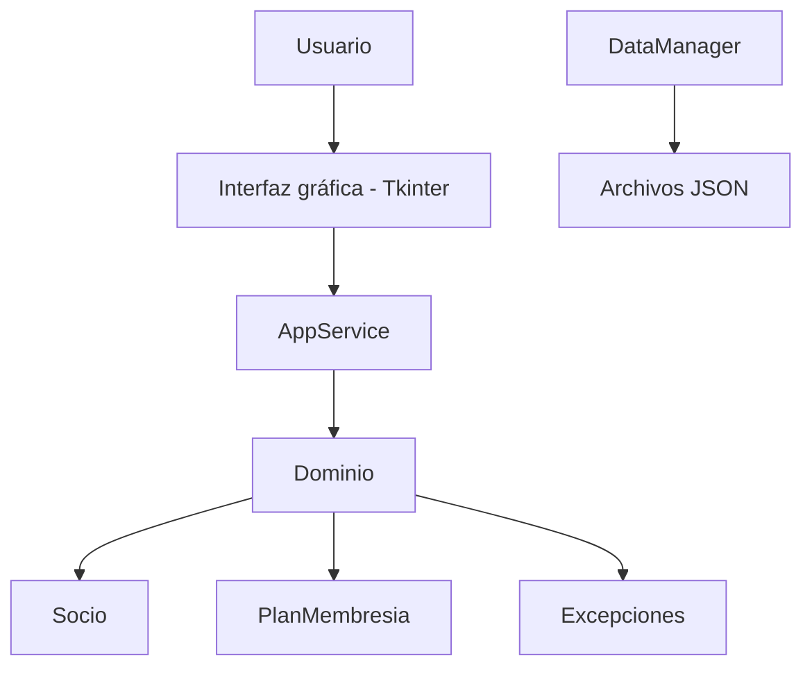
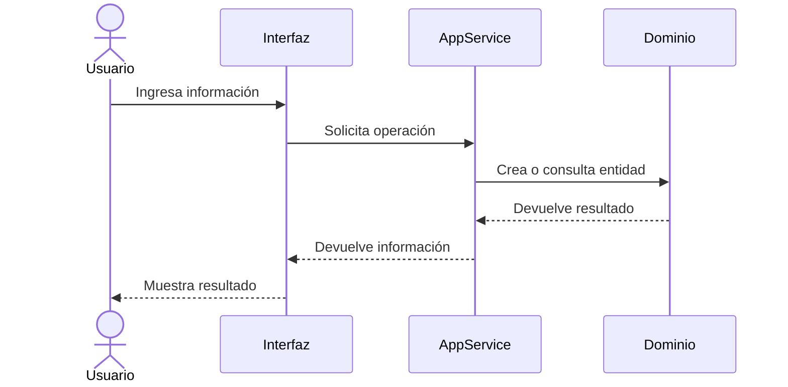
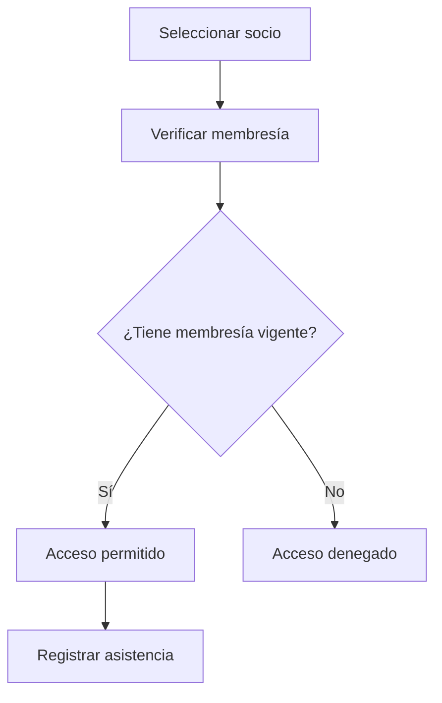

# Arquitectura de NEXO GYM

## Descripción general

NEXO GYM es un sistema para la gestión de membresías y control de acceso de un gimnasio.

El proyecto está organizado por capas para separar las entidades del dominio, la lógica de negocio, la persistencia de datos y la interfaz gráfica.

## Estructura del proyecto

```text
PARCIAL-GYM/
│
├── src/
│   ├── domain/
│   │   ├── __init__.py
│   │   ├── exceptions.py
│   │   └── models.py
│   │
│   ├── services/
│   │   ├── __init__.py
│   │   ├── app_service.py
│   │   └── data_manager.py
│   │
│   └── ui/
│       ├── __init__.py
│       └── cli_interface.py
│
├── tests/
│   ├── test_domain.py
│   └── test_data_manager.py
│
├── main.py
├── architecture.md
└── README.md
```

## Arquitectura por capas

### Dominio

La carpeta `src/domain/` contiene las entidades y excepciones propias del sistema.

Actualmente incluye las entidades:

- `Socio`
- `PlanMembresia`

También incluye excepciones personalizadas para controlar errores de validación, entidades duplicadas, entidades no encontradas y otros errores relacionados con el dominio.

Las entidades del dominio son responsables de validar la información principal del sistema.

### Servicios

La carpeta `src/services/` contiene la lógica de aplicación y los componentes relacionados con el manejo de datos.

La clase `AppService` coordina las operaciones entre la interfaz gráfica y las entidades del dominio.

Actualmente `AppService` se encarga de operaciones relacionadas con:

- Registro y consulta de socios.
- Registro y consulta de planes.
- Registro y consulta de membresías.
- Registro y consulta de entrenadores.
- Control de acceso.
- Registro y consulta de asistencias.
- Consulta de membresías próximas a vencer.
- Validación de fechas de vencimiento.
- Generación del resumen general del sistema.

Dentro de esta misma capa también se encuentra la clase `DataManager`.

`DataManager` permite guardar y cargar información mediante archivos JSON.

Actualmente `DataManager` funciona como un componente de persistencia independiente y todavía no está conectado directamente al flujo principal de `AppService`.

### Interfaz

La carpeta `src/ui/` contiene la interfaz gráfica desarrollada con Tkinter.

La interfaz permite trabajar con las principales funciones del gimnasio:

- Inicio.
- Socios.
- Planes.
- Membresías.
- Entrenadores.
- Control de acceso.
- Asistencias.
- Vencimientos.

La interfaz se comunica con `AppService` para realizar las operaciones del sistema.

La interfaz no contiene directamente las reglas principales de negocio ni realiza la persistencia de datos.

## Diagrama de arquitectura



En el estado actual del proyecto, `AppService` trabaja principalmente con almacenamiento temporal en memoria, mientras que `DataManager` proporciona las operaciones necesarias para persistencia mediante JSON de forma independiente.

## Flujo de una operación



## Flujo de control de acceso



## Punto de entrada

El archivo `main.py` funciona como punto de entrada de la aplicación.

Su responsabilidad es:

1. Crear la ventana principal de Tkinter.
2. Crear una instancia de `AppService`.
3. Inyectar el servicio en `GymInterface`.
4. Iniciar la aplicación mediante `mainloop()`.

De esta manera, la interfaz recibe el servicio necesario para trabajar sin crear directamente la lógica de negocio.

## Pruebas

Las pruebas se encuentran en la carpeta `tests/`.

Las pruebas del dominio se pueden ejecutar mediante:

```bash
python -m unittest discover -s tests -v
```

Actualmente estas pruebas permiten comprobar las validaciones y el comportamiento de las entidades del dominio.

También existen pruebas para `DataManager`, que se pueden ejecutar mediante:

```bash
python -m pytest tests/test_data_manager.py -v
```

Las pruebas de `DataManager` comprueban:

- El guardado de información en archivos JSON.
- La carga de información almacenada.
- El comportamiento cuando se intenta cargar un archivo que no existe.

Durante la integración final del proyecto se ejecutaron correctamente:

```text
15 pruebas del dominio: OK
2 pruebas de DataManager: PASSED
```

También se realizó una prueba funcional del flujo principal:

```text
Socio -> Plan -> Membresía -> Control de acceso -> Asistencia
```

## Persistencia

Actualmente `AppService` mantiene los datos temporalmente en memoria mediante diccionarios y listas.

El proyecto también incluye la clase `DataManager` dentro de `src/services/`, encargada de guardar y cargar información mediante archivos JSON.

`DataManager` cuenta con pruebas para verificar el guardado y carga de datos, así como el manejo de archivos inexistentes.

Actualmente esta persistencia se encuentra separada de la interfaz gráfica y todavía no está integrada directamente al flujo principal de `AppService`.