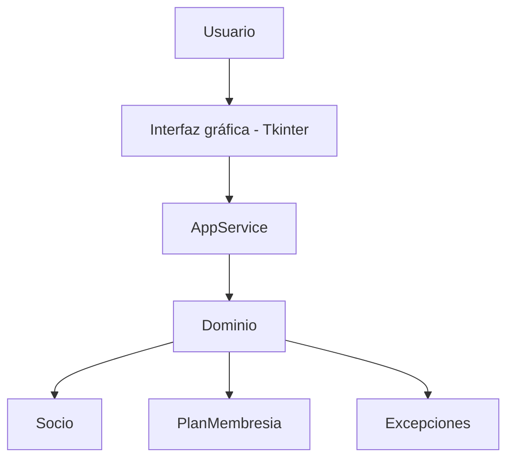
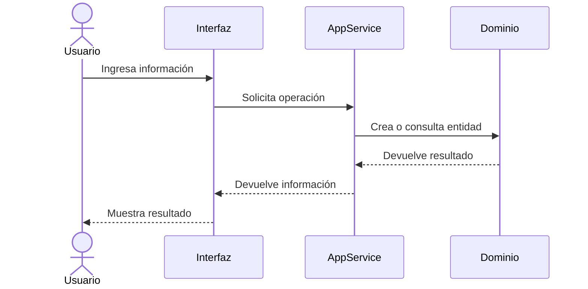

# Arquitectura de NEXO GYM

## Descripción general

NEXO GYM es un sistema para la gestión de membresías y control de acceso de un gimnasio.

El proyecto está organizado por capas para separar las entidades del dominio, la lógica de negocio y la interfaz gráfica.

## Estructura del proyecto

```text
PARCIAL-GYM/
│
├── src/
│   ├── domain/
│   │   ├── __init__.py
│   │   ├── exceptions.py
│   │   └── models.py
│   │
│   ├── services/
│   │   ├── __init__.py
│   │   └── app_service.py
│   │
│   └── ui/
│       ├── __init__.py
│       └── cli_interface.py
│
├── tests/
│   └── test_domain.py
│
├── main.py
├── architecture.md
└── README.md
```

## Arquitectura por capas

### Dominio

La carpeta `src/domain/` contiene las entidades y excepciones propias del sistema.

Actualmente incluye las entidades:

- `Socio`
- `PlanMembresia`

También incluye excepciones personalizadas para controlar errores de validación, entidades duplicadas y entidades no encontradas.

### Servicios

La carpeta `src/services/` contiene la lógica de aplicación.

La clase `AppService` coordina las operaciones entre la interfaz y las entidades del dominio.

Actualmente se encarga de operaciones relacionadas con socios, planes y validación de fechas de vencimiento.

### Interfaz

La carpeta `src/ui/` contiene la interfaz gráfica desarrollada con Tkinter.

La interfaz permite trabajar con las diferentes funciones del gimnasio y se comunica con `AppService` para realizar las operaciones del sistema.

La interfaz no contiene directamente las reglas de negocio.

## Diagrama de arquitectura



## Flujo de una operación



## Punto de entrada

El archivo `main.py` funciona como punto de entrada de la aplicación.

Su responsabilidad es:

1. Crear la ventana principal de Tkinter.
2. Crear una instancia de `AppService`.
3. Inyectar el servicio en `GymInterface`.
4. Iniciar la aplicación mediante `mainloop()`.

## Pruebas

Las pruebas unitarias se encuentran en la carpeta `tests/`.

Se pueden ejecutar mediante:

```bash
python -m unittest discover -s tests -v
```

Estas pruebas permiten comprobar las validaciones y comportamiento de las entidades del dominio.

## Persistencia

Actualmente los datos manejados por `AppService` se almacenan temporalmente en memoria.

La integración de una solución de persistencia mediante archivos queda separada de la interfaz y debe pertenecer a la capa de servicios.